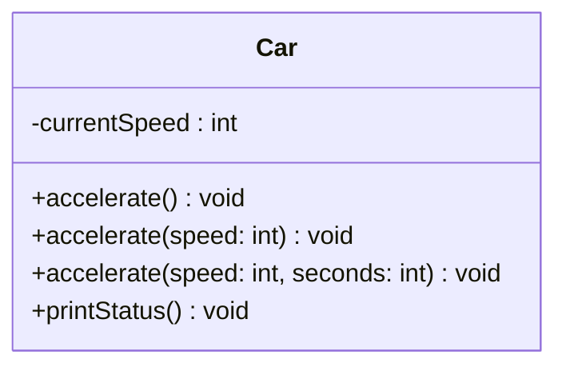

```mermaid
classDiagram
    class Car {
        -currentSpeed : int
        +accelerate() void
        +accelerate(speed: int) void
        +accelerate(speed: int, seconds: int) void
        +printStatus() void
    }
```

