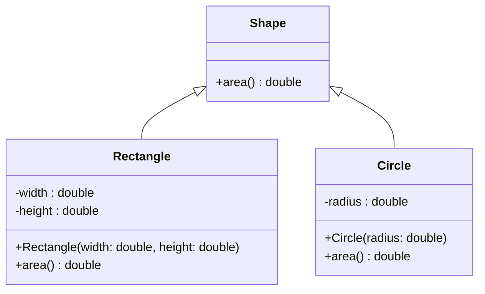

```mermaid
classDiagram
    class Shape {
        +area() double
    }

    class Rectangle {
        -width : double
        -height : double
        +Rectangle(width: double, height: double)
        +area() double
    }

    class Circle {
        -radius : double
        +Circle(radius: double)
        +area() double
    }

    Shape <|-- Rectangle
    Shape <|-- Circle
```

